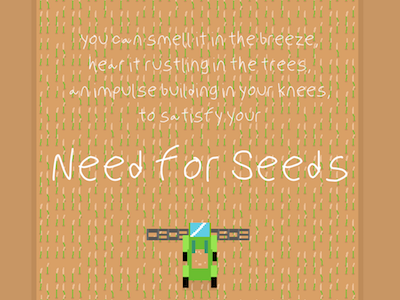
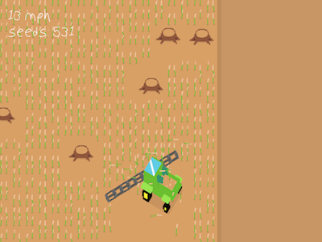

# Need for Seeds

Ludum Dare 41 + Lisp Game Jam 2018 Submission

A cross between a racing game and a farming simulator.

Compiled binaries available at https://tmw.itch.io/need-for-seeds

To build from source, install [Urn](https://github.com/SquidDev/urn) and run `make`. The resulting build can be run with [LÖVE 0.10.2](https://love2d.org) i.e. `love ./build`.

